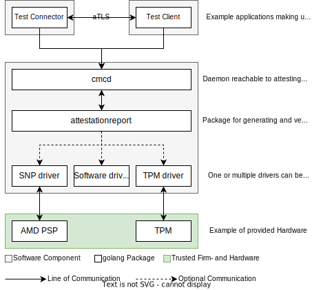

# CMC

[](https://github.com/Fraunhofer-AISEC/cmc/actions/workflows/build.yml)
[](https://pkg.go.dev/github.com/Fraunhofer-AISEC/cmc)
[](https://goreportcard.com/report/github.com/Fraunhofer-AISEC/cmc)

The CMC repository provides tools and software to enable remote attestation of computing platforms,
as well as remote attested TLS channels between those platforms. Currently, the CMC repository
supports Trusted Platform Module (TPM) as well as AMD SEV-SNP attestation.

- [CMC](#cmc)
  - [Architecture Overview](#architecture-overview)
  - [Basic Principle](#basic-principle)
  - [Prerequistes](#prerequistes)
  - [Quick Demo Setup](#quick-demo-setup)
  - [Manual Setup](#manual-setup)
    - [Install Prerequisites](#install-prerequisites)
    - [Build and Install](#build-and-install)
    - [Setup PKI and Metadata](#setup-pki-and-metadata)
  - [Run the CMC](#run-the-cmc)
    - [Establish an attested TLS connection](#establish-an-attested-tls-connection)
  - [Generating Metadata and Setup Alternatives](#generating-metadata-and-setup-alternatives)
    - [Metadata](#metadata)
    - [Serialization Format](#serialization-format)
    - [TPM Setup using Calculated Values](#tpm-setup-using-calculated-values)
  - [Config Files](#config-files)
    - [CMCD Configuration](#cmcd-configuration)
    - [Provisioning Server Configuration](#provisioning-server-configuration)
    - [Platform Configuration](#platform-configuration)
  - [Custom Policies](#custom-policies)
  - [Build](#build)
    - [Build and Run the Provisioning Server](#build-and-run-the-provisioning-server)
    - [Build and Run the CMC Daemon](#build-and-run-the-cmc-daemon)
    - [Build and Run the Test Tool](#build-and-run-the-test-tool)
    - [Customize Builds](#customize-builds)
      - [Reduce General Size](#reduce-general-size)
      - [Reduce Size by Disabling Features](#reduce-size-by-disabling-features)
      - [Regenerate Protobuf gRPC Interface](#regenerate-protobuf-grpc-interface)

## Architecture Overview



The figure shows how the core components interact with each other. The main software components are:
- The *cmcd* daemon acts as an attestation prover and verifier: It collects measurements from
different hardware trust anchors and assembles this data together with signed metadata describing
the platform to an attestation report (prover), or validates the measurements against the metadata.
The *cmcd* provides a gRPC as well as a CoAP REST API.
- The testtool is an exemplary application that make use of the *cmcd* to
generate and verify attestation reports and to create an attested tls connections.
- Drivers for trusted hardware provides the attestation reports and, if available, key storage and
signing functionalities

Refer to the [Architecture](doc/Architecture.md) Readme for more information.

## Basic Principle

The overall exchanged data structure *Attestation Report* does not only contain measurements of
the software running on the platform, but also metadata in the form of *Manifests* and
*Descriptions*. This metadata describes the entire state of the platform and must be signed by
a trusted entity. This allows a verifier to validate the attestation report without knowing the
platform in advance. Examples and tools for creating the metadata on the prover side are given
below.

## Prerequistes

- Running the *cmcd* currently requires a Linux platform. If the *cmcd* is configured to use a TPM,
the *cmcd* must be able to access ```/dev/tpm0```. If AMD SEV-SNP is
used for measurements, the *cmcd* must be run on an AMD server within an SNP Virtual Machine.
- Building the *cmcd* requires *go* (https://golang.org/doc/install)

**Note**: If configured to be used with a TPM, The *cmcd* accesses the TPM and creates keys within
the TPM. You should not run it on your normal work laptop, as it might require the TPM and its keys
storage for secure boot, disk encryption or other purposes. Instead, run it on a dedicated
Virtual Machine (VM) or server.

## Quick Demo Setup

The CMC repository contains a complete local example setup including a demo CA and all required
configurations and metadata. The setup script `example-setup/setup-full-simple` clones this
repository to a folder `cmc-workspace` in the home directory and sets up everything to quickly
test remote attestation. It was tested on Ubuntu 22.04 LTS.

> :warning: **Note:** You should run this only for testing on a development machine

```sh
./setup-full-simple
```

**Afterwards, continue with [Run the CMC](#run-the-cmc)**

## Manual Setup

This setup shows step-by-step how to install the tools, generate the metadata describing the
platform and run and test the tools. It was tested on Ubuntu 22.04 LTS.

### Install Prerequisites

```sh
# Install utils
sudo apt install moreutils golang-cfssl build-essential

# Install tpm-pcr-tools for calculating/parsing TPM PCR values for TPM-based attestation
sudo apt install -y build-essential zlib1g-dev libssl-dev
git clone https://github.com/Fraunhofer-AISEC/tpm-pcr-tools.git
cd tpm-pcr-tools
make
sudo make install # Or launch from individual folders
```

### Build and Install

```sh
# 1. Setup a folder for the cmc workspace (e.g. in your home directory)
CMC_ROOT=$HOME/cmc-workspace

# 2. Clone the CMC repo
git clone https://github.com/Fraunhofer-AISEC/cmc $CMC_ROOT/cmc

# 3. Build CMC
cd $CMC_ROOT/cmc
go build ./...

# 4. Install CMC $GOPATH/bin (export PATH=$PATH:$HOME/go/bin -> .profile/.bashrc)
go install ./...
```

### Setup PKI and Metadata

**1. Create a folder for your CMC configuration**

```sh
mkdir -p $CMC_ROOT/cmc-data
```

**2. Copy and adjust the example metadata templates**
For the example, it is sufficient to copy the templates. For information on how to adjust
the metadata, see [Generating Metadata and Setup Alternatives](#generating-metadata-and-setup-alternatives)
```sh
cp -r $CMC_ROOT/cmc/example-setup/* $CMC_ROOT/cmc-data
```

```sh
# 3. Generate a PKI suitable for your needs. You can use the simple PKI example-setup for testing:
$CMC_ROOT/cmc-data/setup-simple-pki -i $CMC_ROOT/cmc-data -o $CMC_ROOT/cmc-data/pki
```

**3. Generate metadata**

This example uses a TPM as hardware trust anchor and an SRTM measured boot. For other setups,
see [Generating Metadata and Setup Alternatives](#generating-metadata-and-setup-alternatives)

```sh
# Parse the values of the RTM PCRs from the kernel's binary bios measurements as reference values
referenceValues=$(sudo parse-srtm-pcrs -p 0,1,2,3,4,5,6,7 -f json)
# Delete existing reference values in the RTM Manifest
jq 'del(.referenceValues[])' $CMC_ROOT/cmc-data/metadata-raw/rtm.manifest.json | sponge $CMC_ROOT/cmc-data/metadata-raw/rtm.manifest.json
jq --argjson ver "$referenceValues" '.referenceValues += $ver' $CMC_ROOT/cmc-data/metadata-raw/rtm.manifest.json | sponge $CMC_ROOT/cmc-data/metadata-raw/rtm.manifest.json

referenceValues=$(sudo parse-srtm-pcrs -p 8,9 -f json)
jq 'del(.referenceValues[])' $CMC_ROOT/cmc-data/metadata-raw/os.manifest.json | sponge $CMC_ROOT/cmc-data/metadata-raw/os.manifest.json
jq --argjson ver "$referenceValues" '.referenceValues += $ver' $CMC_ROOT/cmc-data/metadata-raw/os.manifest.json | sponge $CMC_ROOT/cmc-data/metadata-raw/os.manifest.json
```

**4. Sign the metadata**

This example uses JSON/JWS as serialization format. For different formats
see [Serialization Format](#serialization-format)

```sh
IN=$CMC_ROOT/cmc-data/metadata-raw
OUT=$CMC_ROOT/cmc-data/metadata-signed
KEY=$CMC_ROOT/cmc-data/pki/signing-cert-key.pem
CHAIN=$CMC_ROOT/cmc-data/pki/signing-cert.pem,$CMC_ROOT/cmc-data/pki/ca.pem

mkdir -p $OUT

signing-tool -in $IN/rtm.manifest.json        -out $OUT/rtm.manifest.json        -keys $KEY -x5cs $CHAIN -format json
signing-tool -in $IN/os.manifest.json         -out $OUT/os.manifest.json         -keys $KEY -x5cs $CHAIN -format json
signing-tool -in $IN/device.description.json  -out $OUT/device.description.json  -keys $KEY -x5cs $CHAIN --format json
signing-tool -in $IN/ak.certparams.json       -out $OUT/ak.certparams.json       -keys $KEY -x5cs $CHAIN --format json
signing-tool -in $IN/tlskey.certparams.json   -out $OUT/tlskey.certparams.json   -keys $KEY -x5cs $CHAIN --format json
```

**5. Adjust the *cmcd* configuration**

Open the cmcd-configuration in `$CMC_ROOT/cmc-data/cmcd-conf.json` and adjust it if required.
For more information about the configuration see [CMCD Configuration](#cmcd-configuration)
or run `cmcd -help`

**6. Adjust the provisioning server configuration**
Open the provisioning server configuration in `$CMC_ROOT/cmc-data/prov-server-conf.json` and
adjust it if required. For more information about the configuration see
[Provisioning Server Configuration](#provisioning-server-configuration) or run `provserver -help`


## Run the CMC

```sh
# Start the provisioning server that supplies the certificates and metadata for the cmcd
provserver -config $CMC_ROOT/cmc-data/prov-server-conf.json

# Build and run the cmcd
cmcd -config $CMC_ROOT/cmc-data/cmcd-conf.json -addr http://127.0.0.1:9001/metadata-signed

# Run the testtool to retrieve an attestation report (stored in current folder unless otherwise specified)
testtool -mode generate

# Run the testtool to verify the attestation report (stored in current folder unless otherwise specified)
testtool -mode verify -ca $CMC_ROOT/cmc-data/pki/ca.pem [-policies $CMC_ROOT/cmc-data/policies.json]
```

### Establish an attested TLS connection

```sh
# Run an attested TLS server
testtool -mode listen -addr 0.0.0.0:4443 -ca $CMC_ROOT/cmc-data/pki/ca.pem

# Run an attested TLS client estblishing a mutually attested TLS connection to the server
testtool -mode dial -addr 127.0.0.1:4443 -ca $CMC_ROOT/cmc-data/pki/ca.pem -mtls
```

**Note**: by default, *cmcd* and *testtool* use localhost port 9955 to communicate. This can be
changed in the *cmcd* configuration and using the `-cmc <host:port>` command line argument for
the testtool.

**Note**: The *cmcd* -addr parameter is the server address where metadata can be found and must
correspond to the address in the *provserver* config

**Note**: The *cmcd* TPM provisioning process includes the verification of the TPM's EK certificate
chain. In the example setup, this verification is turned off, as the database might not contain
the certificate chain for the TPM of the machine the *cmcd* is running on. Instead, simply a
warning is printed. The intermediate and root CA for this chain can be downloaded from the TPM
vendor. The certificates can then be added in to the ```cmc/example-setup/tpm-ek-certs.db```
database. The ```verifyEkCert``` parameter in the *provserver* config can then be set to true.


## Generating Metadata and Setup Alternatives

Metadata and PKI can be generated in different formats and configurations, which is shortly
described in this section.

### Metadata

The example setup contains templates for the required metadata files in JSON. The attributes
of these files can be adjusted according to individual requirements:

- **rtm.manifest.json**: Contains information about the Root of Trust for Measurements, which
usually comprises the reference values (hashes) for BIOS/UEFI, bootloader and other early boot
components
- **os.manifest.json**: Contains the operating system reference values and information
- **company.description.json**: Optional, metadata describing the operater of the computing platform
- **device.description.json**: Metadata describing the overall platform, contains links to
RTM Manifest, OS Manifest and App Manifests
- **ak.certparams.json**: Certificate Parameters for the TPM Attestation Key certificate to be
generated by the provisioning server during TPM credential activation
- **tlskey.certparams.json**: Certificate Parameters for the TLS Key certificate to be
generated by the provisioning server during

### Serialization Format

The attestation report can be serialized to JSON and signed via JSON Web signatures (JWS), or to
CBOR and signed via CBOR Object Signing and Encryption (COSE). This must be specified in the
configuration of the *cmcd* (see [CMCD Configuration](#cmcd-configuration) and the
provisioning server (see [Provisioning Server Configuration](#provisioning-server-configuration))

As CBOR is a binary serialization format, the serialized data is not human-readable. Therefore, the
metadata templates are always in JSON. A converter tool is provided to convert the metadata files
to CBOR before signing them. To convert a metadata file from JSON to CBOR:

```sh
# Convert JSON to CBOR using the converter-tool
$CMC_ROOT/cmc/tools/converter/converter -in <input-file>.json -out <output-file.cbor> -format json
```

### TPM Setup using Calculated Values

In the example setup, the platform is simply seen as a "good reference platform" and the
reference values are generated through parsing the TPM measurements from the `sysfs`. Ideally, the
reference values are generated from the single software artefacts running on the platform. For
QEMU VMs with OVMF and a kernel with appended initramfs, the `calculate-srtm-pcrs` tool can
be used:

```sh
# 5. a) TPM Setup using calculated values
# Calculate reference values
referenceValues=$(calculate-srtm-pcrs --kernel linux-amd64-virtio-systemd-debug.bzImage --ovmf OVMF-DEBUG.fd --format json --pcrs 0,1,2,3,6,7 --eventlog --config configs/ovmf-f80580f56b.cfg)
# Delete all existing reference values
jq 'del(.referenceValues[])' $CMC_ROOT/cmc-data/metadata-raw/rtm.manifest.json | sponge $CMC_ROOT/cmc-data/metadata-raw/rtm.manifest.json
# Insert new reference values
jq --argjson ver "$referenceValues" '.referenceValues += $ver' $CMC_ROOT/cmc-data/metadata-raw/rtm.manifest.json | sponge $CMC_ROOT/cmc-data/metadata-raw/rtm.manifest.json

referenceValues=$(calculate-srtm-pcrs --kernel linux-amd64-virtio-systemd-debug.bzImage --ovmf OVMF-DEBUG.fd --format json --pcrs 4,5 --eventlog --config configs/ovmf-f80580f56b.cfg)
jq 'del(.referenceValues[])' $CMC_ROOT/cmc-data/metadata-raw/os.manifest.json | sponge $CMC_ROOT/cmc-data/metadata-raw/os.manifest.json
jq --argjson ver "$referenceValues" '.referenceValues += $ver' $CMC_ROOT/cmc-data/metadata-raw/os.manifest.json | sponge $CMC_ROOT/cmc-data/metadata-raw/os.manifest.json
```

## Config Files

The *cmcd* and *provserver* require JSON configuration files. An example setup with all
required configuration files is provided in the ```examples/``` folder of this repository. Paths
in the configuration files can either be absolute, or relative to the path of the configuration
file.

### CMCD Configuration

The *cmcd* requires a JSON configuration file with the following information:
- **addr**: The address the *cmcd* should listen on, e.g. 127.0.0.1:9955
- **provServerAddr**: The URL of the provisioning server. The server issues certificates for the
TPM or software keys. In case of the TPM, the TPM *Credential Activation* process is performed.
- **localPath**: the local path to store the meta-data and internal files. In a local setup, all
manifests and descriptions must be placed in this folder. If the provisioning server is used for
the meta-data (*cmcd* command line argument *-fetch-metadata*), the *cmcd* will store those files
in this folder. In this case, it is not required that the folder already exists, the *cmcd* will
handle everything automatically
- **fetchMetadata**: Boolean to specify whether the *cmcd* should load/update its metadata from
the provisioning server. If set to false, the *cmcd* expects all files to be present in the
*localPath*
- **measurementInterfaces**: Tells the *cmcd* prover which measurement interfaces to use, currently
supported are "TPM" and "SNP".
- **signingInterface**: Tells the *cmcd* prover with which interface to sign the overall generated
attestation report. Currently supported are "TPM", "SNP", and "SW". **Note**: This is only for the
overall report. The hardware-based measurements are signed by the respective hardware-based keys
of the measurement interface itself. E.g. if the TPM is selected as measurement interface, the
TPM quote will always be signed with the TPM's AK.
- **useIma**: Bool that indicates whether the Integrity Measurement Architecture (IMA) shall be used
- **imaPcr**: TPM PCR where the IMA measurements are recorded (must match the kernel
configuration). The linux kernel default is 10
- **keyConfig**: The algorithm to be used for the *cmcd* keys. Possible values are:  RSA2048,
RSA4096, EC256, EC384, EC521
- **serialization**: The serialiazation format to use for the attestation report. Can be either
`cbor` or `json`

```json
{
    "addr": "127.0.0.1:9955",
    "provServerAddr": "http://127.0.0.1:9001/",
    "serverPath": "drtm-example/",
    "localPath": "metadata/",
    "fetchMetadata": true,
    "measurementInterfaces": [ "TPM", "SNP" ],
    "signingInterface": "TPM",
    "useIma": false,
    "imaPcr": 10,
    "keyConfig": "EC256",
    "serialization": "json",
}
```

### Provisioning Server Configuration

The provisioning server requires a configuration file with the following information:
- **port**: The port the server should listen on
- **deviceSubCaKey**: The private key of the CA used to sign the device certificates. For the demo,
the *Device Sub CA* key from the *ids-pcp* tool located in
```ids-pcp/examples/demo_setup/pki/ca/device_sub_ca-key.pem``` can be used
- **deviceSubCaCert**: The certificate of the CA used to sign the device certificates. For the
demo, the *Device Sub CA* certificate from the *ids-pcp* tool located in
```ids-pcp/examples/demo_setup/pki/ca/device_sub_ca.pem``` can be used
- **caCert**: The root CA. For the demo, the *CA* certification from the *ids-pcp* tool
located in ```ids-pcp/examples/demo_setup/pki/ca/ca.pem``` can be used
- **httpFolder**: The root folder containing metadata (manifests and descriptions) that is served
by the provisioning server. This root folder must contain folders that match the **serverPath**
from the *cmcd* config of the individual devices. Inside the folders, the metadata
(manifests and descriptions) for the device must be stored. The files can be generated with
the *ids-pcp* tool.
- **verifyEkCert**: Boolean, specifies if the EK certificate chain should be validated via the
**tpmEkCertDb**
- **tpmEkCertDb**: SQLite database containing intermediate CA and CA certificates from the TPM
manufacturers. The provisioning server uses these certificates to verify the TPM
Endorsement Key (EK) certificate. The repository contains an example database with the
certificates of some TPM manufacturers which can be used. For different manufacturers,
certificates might need to be added.
- **vcekOfflineCaching**: Boolean, specifies whether AMD SEV-SNP VCEK certificates downloaded from the AMD KDS server should be stored locally for later offline retrieval
- **vcekCacheFolder**: The folder the downloaded VCEK certificates should locally be stored (only
relevant if vcekOfflineCaching is set to true)

```json
{
    "port": 9000,
    "signingKey": "pki/ca-key.pem",
    "certChain": [
        "pki/ca.pem"
    ],
    "httpFolder": "./",
    "verifyEkCert": true,
    "tpmEkCertDb": "tpm-ek-certs.db",
    "vcekOfflineCaching": true,
    "vcekCacheFolder": "ca/vceks",
    "serialization": "json"
}
```

### Platform Configuration

The *cmcd* does not provide platform security itself, it only allows to make verifiable claims
about the software running on a platform. Thus, a secure base plaftorm is essential for the
overall security of the platform. This includes the kernel configuration, OS configuration,
file systems and software running on the host. Some configurations are mandatory for the *cmcd*
to work (e.g., if used, TPM-support must be enabled in the kernel configuration).

Further information about the platform configuration can be found
[here](doc/platform-configuration.md)

## Custom Policies

The basic validation verifies all signatures, certificate chains and reference values against the
measurements. To enable custom policies, such as the verification of certain certificate properties,
the blacklisting of certain software artifacts with known vulnerabilities or the enforcement of a
four eyes principle mandating different PKIs for the manifests, the attestation report module
implements a generic policies interface.

The current implementation contains the `attestationpolicies` module which implements a javascript
engine. This allows passing arbitrary javascript files via the `testtool` `-policies` parameter.
The policies javascript file is then used to evaluate arbitrary attributes of the JSON
attestation result output by the `cmcd` and stored by the `testtool`. The attestation result
can be referenced via the `json` variable in the script. The javascript code must return a single
boolean indicating success or failure of the custom policy validation. A minimal policies file, verifying only the `type` field of the attesation result could look as follows:

```js
// Parse the verification result
var obj = JSON.parse(json);
var success = true;

// Check the type field of the verification result
if (obj.type != "Verification Result") {
    console.log("Invalid type");
    success = false;
}

success
```

## Build

All binaries can be built with the *go*-compiler. For an explanation of the various flags run
<binary> -help

### Build and Run the Provisioning Server

```sh
cd provserver
go build
./provserver -config <config-file>
```

### Build and Run the CMC Daemon

The below commands show how to build and run the cmcd. At runtime, a client can provide the cmcd
with root certificates that are to be used during the verification of the attestation report. If
these are not provided, the cmcd uses the system's root certificates instead. Under Linux, these are
commonly stored under `/etc/ssl/certs`. To temporarily add certificates, see the commands
using `SSL_CERT_FILE` and `SSL_CERT_DIR` below.

```sh
cd cmcd
go build
./cmcd -config <config-file> -addr <server-metadata-address>
# with added custom certificates
SSL_CERT_FILE=../example-setup/pki/ca/ca.pem ./cmcd -config <config-file> -addr <server-metadata-address>
SSL_CERT_DIR=../example-setup/pki/ca/ ./cmcd -config <config-file> -addr <server-metadata-address>
```

### Build and Run the Test Tool

```sh
cd testtool
go build
./testtool [-mode < generate | verify | dial | listen >] [-addr <remote-address>] [-cmc <cmc-address>] [-report <attestationreport-file>] [-result <attestationresult-file>] [-nonce <nonce-file>] [-ca <file>] [-mtls][-policies <file>] [-api < coap | grpc >]
```

### Customize Builds

#### Reduce General Size

The size of all binaries can be reduced via go linker flags:
```sh
go build ldflags="-s -w"
```
For more information see the go documentation.

#### Reduce Size by Disabling Features

The size of the binaries can further be reduced by a considerable amount through disabling
unused features during build time. The `go build` command builds each binary with all features
enabled. The project uses the go build system with build tags to disable features.

To disable all features, use the custom `nodefaults` tag. You can then enable the features you
want to build via additional tags.

Currently supported tags for the `cmcd` and `testtool` are:
- `grpc` Enables the gRPC API
- `coap` Enables the CoAP API

To build all binaries with `coap` but without `grpc` support:
```sh
go build -tags nodefaults,coap
```

> Note: disabling features during build-time but specifying to use them in the configuration files
> will lead to errors during runtime

#### Regenerate Protobuf gRPC Interface

see: https://grpc.io/docs/languages/go/quickstart/ for newer versions

```sh
sudo apt install -y protobuf-compiler
go install google.golang.org/protobuf/cmd/protoc-gen-go@v1.28
go install google.golang.org/grpc/cmd/protoc-gen-go-grpc@v1.2
cd grpcapi/
make
```
