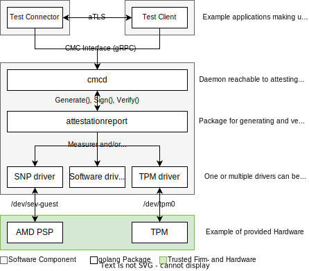

# Architecture

The figure shows how the core components interact with each other.

## Components
The following components correspond to the packages / directories of this repository.

__cmcd:__
The CMC daemon (*cmcd*) is the main component running on the platform. On request, the cmcd either
generates or verifies an attestation-report, i.e. the state of the platform. The cmcd provides
a gRPC interface to access its services (*grpcapi*), as well as a REST CoAP interface. For the
generation and verification of attestation reports, the *cmcd* relies on the *attestationreport*
package.

__attestationreport:__
The *attestationreport* package provides a generic JSON-based serialization format to summarize
the meta-data describing the software running on the computer platform. Enabling trust in this
meta-data requires a hardware-based Root-of-Trust (RoT) that provides the possibility to store keys
and measurements of the software running on the platform. The *attestationreport* therefore
implements a generic *Measurement* interface, as well as a generic *Signer* interface.
These interfaces must be implemented by *drivers* that provide access to a hardware based RoT.
Currently, this repository contains a *tpmdriver*, an *snpdriver* and an *swdriver*.

__tpmdriver:__
The *tpmdriver* package interfaces with a Trusted Platform Module (TPM) as the RoT.
The TPM is used to store cryptographic keys, store the software measurements (hashes) in its
Platform Configuration Registers (PCRs) during the *Measured Boot* and to generate and sign *Quotes*
which can be used to verify the platform state. Furthermore, the *tpmdriver* can use the *ima*
package interfacing with the kernel's Integrity Measurement Architecture (IMA) for obtaining
detailed measurement lists of the kernel modules, firmware and optionally further components
running on the platform. The *tpmdriver* can therefore act as *Measurement* as well as as
*Signer* interface.

__snpdriver:__
The *snpdriver* interfaces with the AMD SEV-SNP SP. It retrieves SNP measurements in the form of
an SNP attestation report as well as the certificate chain for this attestation report from the
respective AMD servers. Currently, it can only act as *Measurement* interface.

__swdriver:__
The *swdriver* simply creates keys in software for testing purposes and can be used as *Signer*
interface. **Note**: This should mainly be used for testing purposes.

__provserver:__
During provisioning, the cmcd requires interaction with a provisioning server (*provserver*). The
server can provide certificates for software signing, perform the TPM *Credential Activiation* and
provision TPM certificates, and can provide the metadata (manifests and configurations) for the
*cmcd*. The server is mainly for demonstration purposes. In productive setups, its functionality
might be split onto different servers (e.g. a CA server and an internal metadata server).

__attestedtls:__
The *attestedtls* package provides an exemplary protocol which shows how a connection between two parties can be performed using remote attestation. After a tls connection is established, additional steps are performed to obtain and verify the attestation reports from the respective communication partner. Only then is the connection provided to the server / client.

__testconnector / testclient:__
The *testconnector* and *testclient* make use of the attested TLS package and thus services provided by the cmcd to create an attested TLS connection. The client can be configured to use one-sided or mutual attestation

### Interfaces
- __CMC Interface:__ A gRPC interface defining services for signing, measuring and verification operations (TLSSign(), TLSCert(), Attest(), Verify())
- __Measurer Interface:__ One of the golang interfaces a driver can implement. It defines the Measure() function
- __Signer Interfacfe:__ One of the golang interfaces a driver can implement. Importantly, it defines access to the crypto.PrivateKey interface for signing oprations as well as the certificates of the associated public key
- __Device Interface:__ An interface as defined by the used device
- __aTLS:__ Offers wrappers around the TLS listener and dialer, namely tls.Dial() and net.Listen(), and uses the same function structure. It performs additional remote attestation operations after the TLS handshake is complete. Only once these are successful is the established connection returned
